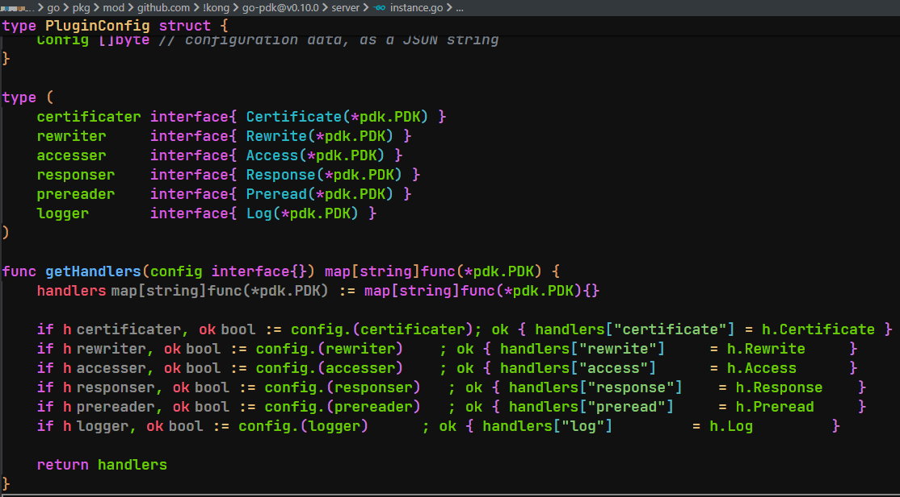

golang 的函数,结构体,方法,变量等大写开头的都是可见的,小写开头的都是不可见的. 具体可以参考任意一本书籍或者官方文档. 这里想说的其实不是这个. 这里想说的是, 这个可见性只在调用的瞬间有意义. 当我传递一个小写开头的对象作为参数, 或者通过`:=`创建私有对象,都是没有任何问题的. 具体可以参考如下代码:

文件树结构如下:

```txt
# tree
.
├── go.mod
├── main.go
└── pkg
    └── heihei.go
```

main.go

```go
package main

import (
	"fmt"
	"visibility/pkg"
)

type cfg struct {
}

func (c *cfg) Rollback() {
	fmt.Println("Rollback")
}

func main() {
	pkg.Register(&cfg{})

	a := pkg.GetA()
	*a = "2"
	fmt.Println(*pkg.GetA())
    pkg.PrintA()
}

```

heihei.go

```go
package pkg

import "fmt"

type rollbacker interface {
	Rollback()
}

var a = "1"

func GetA() *string {
	return &a
}

func PrintA() {
	fmt.Println(a)
}
func Register(r rollbacker) {
	r.Rollback()
}

```

执行结果如下:

```txt
# go run main.go
Rollback
2
2
```

可以看到, 私有对象可以任意的传递, 包括 interface 都可以是小写开头的.

## 实际的应用

我是在 kong pkg 上面看到的这个用法, 他们的代码参考截图:


